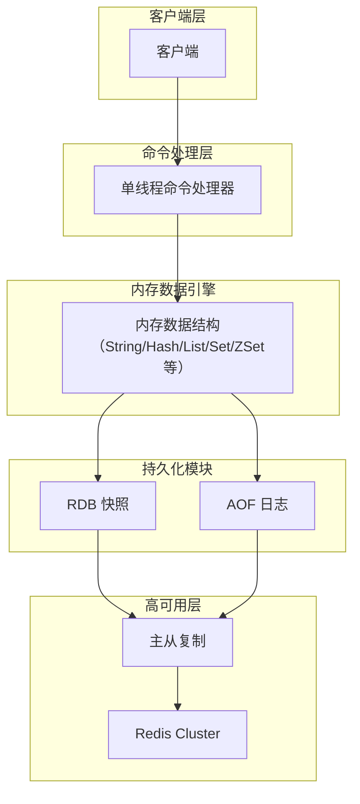

# Redis 快速上手：用内存数据结构解决高并发场景


*Redis 快速上手：用内存数据结构解决高并发场景 - 系统架构概览*


---


## 内存存储 · 数据结构支持 · 单线程模型 · 持久化 · 高可用 · 缓存雪崩 · 延迟队列

**阅读时间**: 5 min

> 只需 5 分钟，理解 Redis 如何通过内存存储与多数据结构支撑高并发业务。

## 目录

- [Redis 核心能力与典型应用场景](#redis-核心能力与典型应用场景)


---


在现代高并发系统中，快速读写和低延迟是关键需求。Redis 作为一款基于内存的高性能数据结构存储系统，凭借其丰富的数据类型和极简架构，成为缓存、消息队列和实时排行榜等场景的首选。本文将带你快速掌握 Redis 的核心能力与典型应用场景。


---


## Redis 核心能力与典型应用场景

你是否遇到过这样的场景：用户请求激增，数据库瞬间被打垮，系统响应延迟飙升甚至完全不可用？或者在实现排行榜、消息队列、延迟任务等常见功能时，不得不引入多个中间件，导致架构复杂、运维成本陡增？这些问题的背后，往往源于对数据访问层的性能和灵活性缺乏有效支撑。而 Redis，正是为解决这类高并发、低延迟、多样化数据处理需求而生。

> Redis 不只是一个缓存，而是一个可编程的内存数据引擎。

### 内存存储 + 单线程无锁：极致性能的基石

Redis 的核心优势首先体现在其**基于内存的存储模型**与**单线程命令处理机制**的结合。所有数据驻留在 RAM 中，避免了磁盘 I/O 的瓶颈；同时，Redis 采用单线程顺序执行客户端命令（自 Redis 6.0 起部分 I/O 可多线程，但命令执行仍为单线程），彻底规避了多线程环境下的锁竞争与上下文切换开销。这种“无锁”设计使得 Redis 在普通硬件上即可轻松实现**每秒超过 10 万次的操作吞吐量**——实际性能可达 **10 万至 50 万 QPS**，具体取决于硬件配置、网络延迟、操作类型（如 `SET`/`GET`/`DEL`）、数据大小及并发客户端数量。

官方基准测试工具 `redis-benchmark` 可用于量化性能。例如，在典型配置下（如 `-c 50` 并发连接、`-P 50` 管道批处理、`-d 1024` 字节数据载荷），执行 `GET` 操作的吞吐量可显著提升。这表明 Redis 的高性能不仅源于架构设计，也高度依赖于合理的使用方式和部署环境。



*Redis 核心架构：展示客户端请求经单线程处理器操作内存数据结构，并通过 RDB/AOF 持久化支撑主从复制与 Cluster 高可用的数据流向*

### 多数据结构：一库多能，适配多样业务场景

不同于传统键值存储仅支持字符串，Redis 提供了**五种核心数据结构**：字符串（String）、哈希（Hash）、列表（List）、集合（Set）和有序集合（Sorted Set），以及高级结构如 **Bitmaps**（位图）、**HyperLogLogs**（基数估计算法）和 **Geospatial Indexes**（地理空间索引）。每种都针对特定场景进行了深度优化：

- **Hash** 适合存储对象属性（如用户资料），减少序列化开销；
- **List** 可作为轻量级消息队列，通过 `LPUSH`/`BRPOP` 实现生产消费模型；
- **Sorted Set** 则凭借其按分数排序的特性，天然适用于**排行榜**（如游戏积分榜）和**延迟任务队列**。

以延迟任务队列为例，可通过以下方式实现：
```bash

# 添加任务：ZADD delay_queue <执行时间戳> <任务ID>

ZADD delay_queue 1717020000 task_123

# 消费者定期轮询（例如每秒执行）：

ZRANGEBYSCORE delay_queue -inf <当前时间戳> LIMIT 0 10  # 获取待执行任务

# 处理任务后删除

ZREM delay_queue task_123
```
该模式将任务的执行时间作为 `score`，消费者通过 `ZRANGEBYSCORE` 查询已到期任务，再通过 `ZREM` 安全移除，避免重复消费。这种实现简洁高效，无需额外中间件。

这种“数据结构即 API”的设计理念，让开发者无需额外引入 Kafka、ZooKeeper 等组件，就能在 Redis 内完成多种复杂逻辑。

### 高可用与持久化：从缓存到可靠存储

尽管 Redis 以内存存储著称，但它并非“易失性玩具”。通过 **RDB（快照）** 和 **AOF（追加日志）** 两种持久化机制，Redis 可在宕机后恢复数据。RDB 适合做备份和灾难恢复，AOF 则提供更高的数据安全性。更进一步，**主从复制 + 哨兵（Sentinel）** 可实现自动故障转移，而 **Redis Cluster** 则通过分片（sharding）支持水平扩展，满足 TB 级数据存储与高可用需求。

### 应对缓存雪崩：工程实践中的关键防护

在实际使用中，缓存失效策略若设计不当，极易引发“**缓存雪崩**”——大量 key 同时过期，导致请求瞬间穿透至数据库，造成服务雪崩。对此，业界最佳实践是：**为缓存设置随机过期时间**。例如，基础过期时间为 30 分钟，则实际过期时间设为 `30 ± 5` 分钟的随机值，从而将失效压力分散到时间窗口内，避免集中冲击。

> ⚠️ 注意: 缓存雪崩只是 Redis 使用中的典型风险之一，还需结合布隆过滤器防穿透、互斥锁或逻辑过期防击穿，构建完整的缓存防护体系。

需要特别区分三种常见缓存异常场景及其应对机制：

- **缓存穿透**：指查询一个**根本不存在的数据**（如恶意攻击或无效 ID），导致每次请求都绕过缓存直达数据库。防护方案通常是在缓存层前置**布隆过滤器（Bloom Filter）**，预先拦截不存在的 key；或对空结果也进行短暂缓存（如缓存 `null` 值 1~2 分钟）。
  
- **缓存击穿**：指某个**热点 key 在过期瞬间**，大量并发请求同时发现缓存失效，争先恐后回源重建缓存，压垮数据库。解决方案包括：
  - **互斥锁（Mutex Lock）**：仅允许一个线程加载数据，其余线程等待；
  - **逻辑过期（Logical Expiry）**：缓存中同时存储数据和过期时间戳，后台异步更新，读取时若发现逻辑过期则触发刷新，但不阻塞请求。

- **缓存雪崩**：如前所述，是**大量 key 同时失效**导致的全局性穿透，核心在于**打散过期时间**。

三者成因不同，防护策略亦不可混用。理解其本质差异，是设计健壮缓存系统的关键。


---


Redis 的真正魅力，在于它将高性能、丰富数据模型与工程可靠性融为一体。无论是作为缓存加速器、会话存储、实时计数器，还是消息中间件、任务调度引擎，Redis 都能以极简的接口提供强大的能力。理解其核心机制与适用边界，是构建现代高性能系统的关键一步。

---


## 总结

- Redis 以内存+单线程实现极致性能
- 丰富数据结构支持多样化业务逻辑
- 内置持久化与高可用机制保障可靠性

## 延伸阅读

尝试在本地部署 Redis 并使用 redis-cli 探索不同数据结构命令

## 参考资料

### 🌐 网络来源

1. https://redis.io/documentation
2. https://redis.io/topics/data-types-intro
